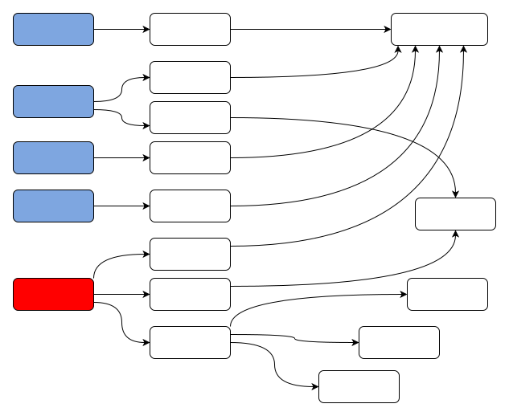
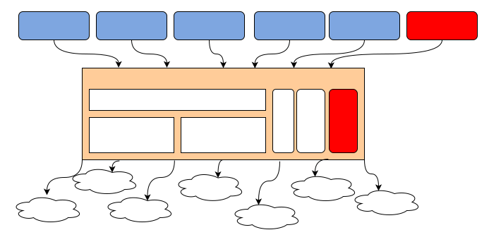
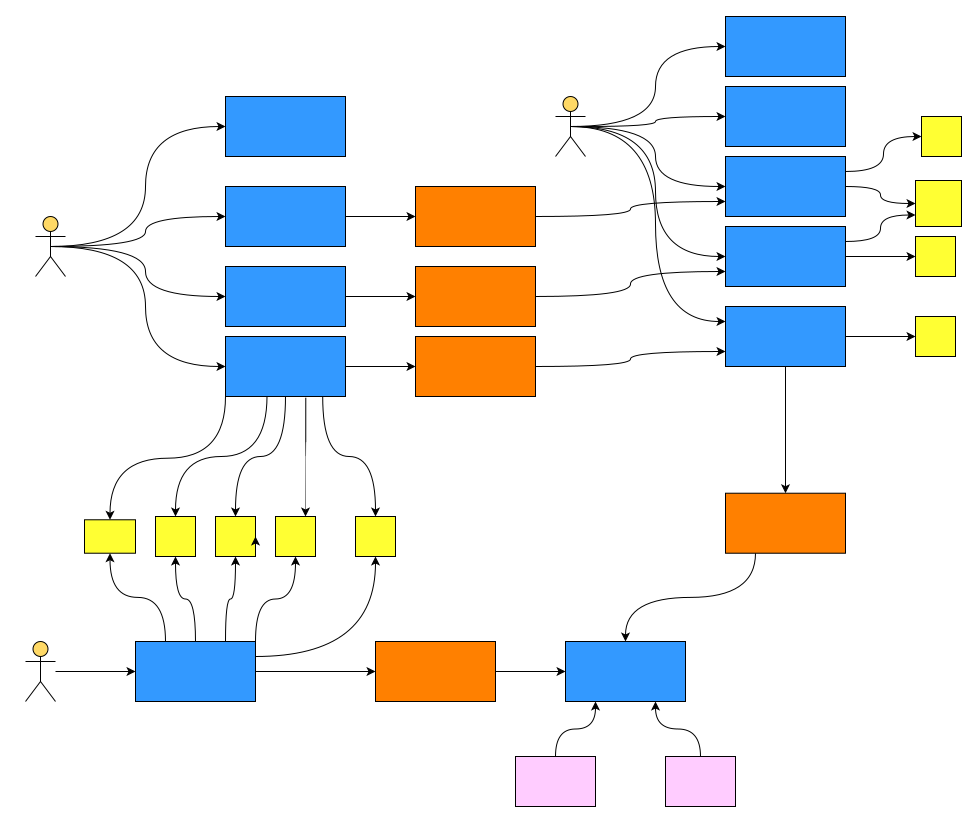
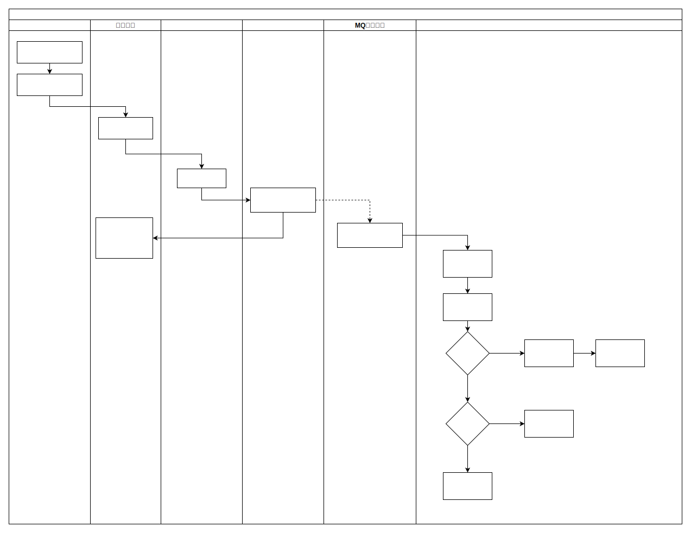

# tarena-pigeon
信鸽-与非科技开源消息中台(Message Notify Middle Platform)

# quick start
## maven build 
直接通过以下命令一键构建
```$xslt
sh build
```
## 项目部署
- 启动后台管理系统mnmp-admin
- 启动调度服务 mnmn-schedule
- 启动消息passport 用户系统（信鸽支持简单用户系统，支持第三方接入）
- 启动consumer MQ消息端（目前只支持rocket mq） 
- 启动mnmp-provider 实时接口服务


# 架构
概要设计
## 背景
### 中小企业IT架构一般形式

### 项目目标
每个业务方都需要对接一次后端消息供应商服务，而且对于延迟消息和周期消息需要定制开发。而对于以上业务场景在很多行业中都存在对接多个供应商场景，开源的目的为以上问题提供统一解决方案，统一入口，并提供稳定、可靠、高性能、易用的消息中台服务。
## 架构设计
通过消息中台统一各业务发送入口，协调各消息供应商服务，降低业务方调用成本，简化使用方调用方式。统一保障系统稳定性。
### 业务架构



### 模块全景图


### 用例描述



### 业务流程
#### C端实时接口业务流程


#### 后台消息调度



# 详细设计
## 功能服务拆解
### 消息服务
 承接C端实时请求，如验证码、警报短信，提供所有消息发送能力。
- 支持网关流量控制，保障接口服务稳定。
- 保证消息及时触达用户。
  1. RPC接到消息后优先直接发送，减少延迟。
  2. 为避免离线消息堆积影响及时消息延迟，需要将离线和及时消息分开解耦。
- 根据机器负载支持并发线程数配置，超出负载则通过mq 削峰。
- 支持消息状态跟踪
### 调度服务
实现延迟消息和周期消息的统一调度。
- 支持延迟消息及周期消息发送。
  - 支持目标存储。
  - 支持消息状态跟踪。
- 单机调度。
- 支持消息重试及幂等消费。
### 后台管理
实现消息中台、调度、监控等基础数据维护。包括消息模块管理、签名管理、供应商管理、业务方管理、消息调度信息配置等等。
- 业务方接入管理
- 供应商管理
- 签名管理
- 模板管理 
- 任务管理
- 消息状态管理
### 消息消费
消费MQ的消息并调用统一分发逻辑，实现对不同供应商的消息支持。
## 非功能性详细设计
### 模块划分
依赖抽象接口不依赖具体实现，实现模块解耦，方便后续功能扩展，比如可以更换mysql存储（考虑大并发场景下的存储选型）
### 监控
提供monitor 埋点支持，对接prometheus
### 消息分发
提供对接第三方供应链的统一接口与对应实现，消息实际发现组件。以jar 包形式提供给各应用服务。
### 存储
提供抽象存储能力，可以对接mysql clickhorse hbase es 等多数据源。
主要用于基本业务数据存储（mysql）
流量统计与监控(redis tair 等)
统计分析报表(clickhorse)
### 业务指标监控
1. APP每天调用接口总次数限制
2. 手机号每天发送次数限制
3. QPS流控
4. 并发流控

### 限流支持-[sentinel](https://github.com/alibaba/Sentinel)
1. 项目采用sentinel流控框架,考虑成本因素,该系统默认使用json文件形式配置接口限流,使用者可自行扩展
1. **provider**工程中使用限流,配置在application.yaml中的alibaba.sentinel.config.path配置
1. 目前仅实现qps,并发和对手机号限流,限流文件可见**FlowRule.json**,**ParamFlowRule.json**
1. 具体使用可见sentinel使用说明

### 短信模版使用

1. 例如用户在一些短信平台申请了一个通用模版

2. 我们要发送的短信内容如下

    `hello:${name},您于${time},有${courseName}课`

3. 我们新建短信模版,模版内容如上

4. 然后就是发短信流程,我们新建task任务

5. 新建任务时会下载个模版excel,target为目标手机号,第二个param就填写json形式的内容

6. json内容对应短信内容的三个字段, `{"name":"zhangsan","time":"2022-03-03 11:30","courseName":"语文课"}`

7. 具体实现代码如下

8. ```java
    DollarPlaceholderReplacer dollarPlaceholderReplacer = new DollarPlaceholderReplacer();
    Json json = new FastJson();
    dollarPlaceholderReplacer.setJsonProvider(json);
    Map<String, Object> param = new HashMap<>();
    param.put("name", "zhangsan");
    param.put("time", "2021-11-11");
    param.put("courseName", "语文");
    // content 是发个供应商的具体内容
    String content = dollarPlaceholderReplacer.buildContent("{\"content\":\"hello:${name},您于${time}有					${courseName}课\"}", param);
    ```

    


### 分层领域模型规约定义
根据阿里工程架构规范，并结合实际应用场景，考虑代码的可读性，可维护性并满足迪米特原则的前提下，兼顾开发维护成本。将请求响应参数定义区分，详细明确分层模型定义。
- 结果实体
  - service层以DO BO(DTO)结尾  
  - mananger层DO BO(DTO)结尾  
  - dao层以DO BO结尾  (单表的某些字段)
  - RPC接口传输层以DTO结尾  
  - controller层传递给页面以View结尾 
- 请求实体类：  
  上层向下层提交请求的时候，如果没有封装成对象，则用Param结尾的实体
  写请求：  
  - controller层Param结尾
  - service层DTO BO(Param)结尾  
  - mananger层DO(Param)结尾  
  - dao层DO结尾  
  查请求  
  - controller层Query结尾  
  - service层Query结尾  
  - mananger层Query结尾  
  - dao层Query结尾  


协作流程
---

